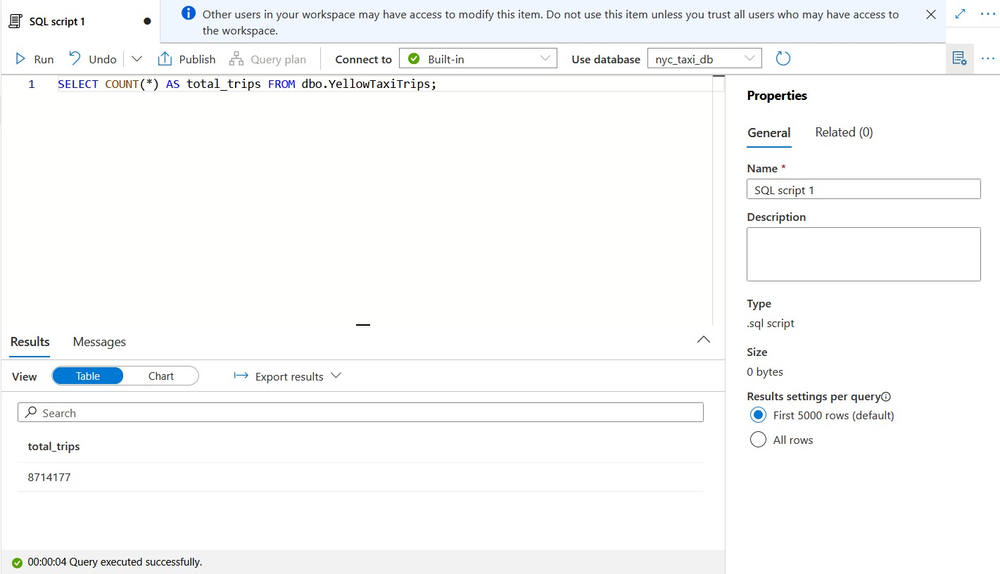
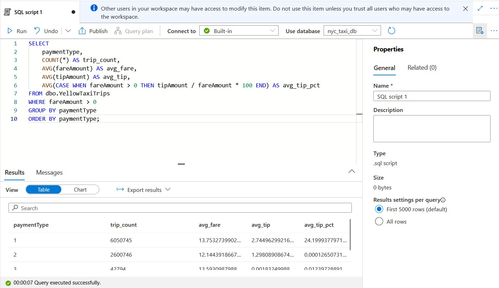
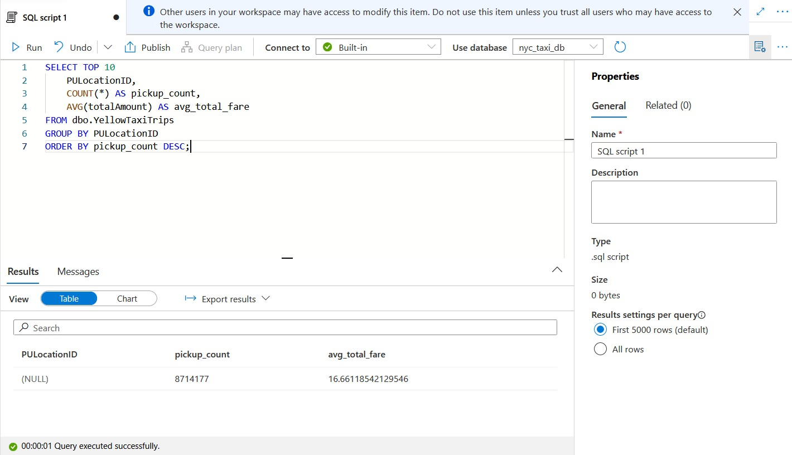
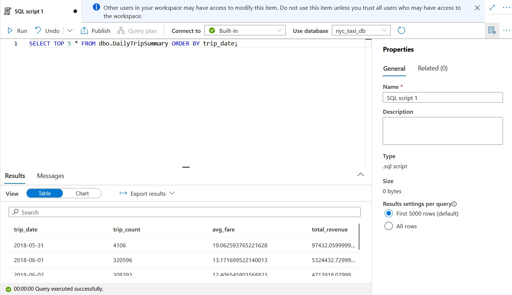

# Big Data Solution — Azure Synapse Serverless SQL + Data Lake

**Project 10** — a data lake analytics solution built with Azure Synapse Analytics
**serverless SQL pool**, querying NYC Taxi trip data (Parquet) directly from Azure
Data Lake Storage Gen2 using T-SQL — no cluster, no data warehouse load, no
always-on compute.

## Architecture

```
NYC TLC public dataset (Azure Open Datasets)
        │  azcopy (service-to-service copy)
        ▼
┌─────────────────────────────┐
│  ADLS Gen2 storage account   │
│  ┌─────────┐   ┌──────────┐  │
│  │  raw/   │   │ curated/ │  │   <- CETAS writes transformed output here
│  └─────────┘   └──────────┘  │
└─────────────────────────────┘
        │
        ▼
┌─────────────────────────────┐
│  Synapse workspace           │
│  Built-in serverless SQL pool│  <- pay-per-TB-scanned, no idle cost
│  External tables / OPENROWSET│
└─────────────────────────────┘
        │
        ▼
   T-SQL analytical queries
```

## Why serverless SQL (not a dedicated SQL pool or Spark)

- **No idle cost.** Serverless SQL pools have no cluster to provision or leave
  running — you're billed per data volume scanned by each query
  (~$5/TB), not per hour. This is the opposite cost model from the always-on
  online endpoint in Project 11 — worth contrasting the two in an interview.
- **Query in place.** T-SQL runs directly against Parquet/CSV files in the
  data lake — no ETL load step required before you can start analyzing.
- **Familiar tooling.** Standard T-SQL, works with existing BI tools (Power BI,
  SSMS, Azure Data Studio) via the serverless SQL endpoint.

## Results

8.7 million real NYC taxi trips, queried directly from Parquet files in the
data lake via serverless SQL - no cluster, no data load, no always-on cost.


*8,714,177 trips confirmed via `SELECT COUNT(*)` against the external table.*


*Credit card trips average ~24% tips; cash trips show ~0% - cash tips
aren't captured in the trip data, a real characteristic of the dataset.*


*Top pickup zones by trip volume, aggregated from 8.7M rows.*


*`CREATE EXTERNAL TABLE ... AS SELECT` (CETAS) used to write an aggregated
daily summary back to the data lake in Parquet format - serverless SQL as
a lightweight transformation engine, not just a read-only query tool.*

More screenshots covering the full build (including the real debugging
trail) are in [`docs/screenshots/`](docs/screenshots/).

## Repo structure

```
azure-synapse-nyc-taxi/
├── README.md
├── setup/
│   ├── create_resources.sh   # resource group, ADLS Gen2, Synapse workspace
│   ├── ingest_data.sh        # copy NYC Taxi Parquet data into the data lake
│   └── cleanup.sh            # full teardown
├── sql/
│   ├── 01_create_external_objects.sql   # data source, file format, external table
│   └── 02_analysis_queries.sql          # analytical T-SQL queries
└── docs/
    └── screenshots/           # Synapse Studio screenshots (added after running)
```

## Prerequisites

- Azure CLI logged in (`az login`)
- `azcopy` installed ([download](https://learn.microsoft.com/azure/storage/common/storage-use-azcopy-v10))
- An Azure subscription with quota for a Synapse workspace in your target region

## Setup

Run one command at a time, verify output before proceeding.

```bash
# 1. Provision the storage account (ADLS Gen2) and Synapse workspace
bash setup/create_resources.sh

# 2. Copy one month of NYC Yellow Taxi trip data into your own data lake
bash setup/ingest_data.sh
```

`create_resources.sh` provisions:
- Resource group `rg-synapse-nyc-taxi`
- Storage account with hierarchical namespace enabled (`raw` and `curated` containers)
- Synapse workspace `synapse-nyc-taxi-<suffix>` (built-in serverless SQL pool
  included automatically — nothing extra to create or pay for until queried)
- A firewall rule allowing your current IP to reach the workspace

`ingest_data.sh` copies **one month** of Yellow Taxi Parquet files (~100-150MB)
from Microsoft's public NYC TLC dataset directly into your `raw` container via
`azcopy` — a service-to-service copy, so the data never touches your local
machine.

## Querying

Open the Synapse Studio URL printed at the end of `create_resources.sh`
(or `https://web.azuresynapse.net`), connect to the **Built-in** serverless
SQL pool, and run:

1. `sql/01_create_external_objects.sql` — sets up the external data source,
   file format, and an external table over the ingested Parquet files
2. `sql/02_analysis_queries.sql` — sample analytical queries: trips per day,
   average fare by hour, tip percentage by payment type, top pickup zones

You can also run these via `sqlcmd` or Azure Data Studio against the
serverless SQL endpoint shown in the workspace overview
(`<workspace-name>-ondemand.sql.azuresynapse.net`).

## Cost

- **Storage**: pennies/month for ~150MB of Parquet data
- **Synapse workspace**: free to have provisioned — no charge for the
  workspace itself or the built-in serverless SQL pool sitting idle
- **Queries**: ~$5 per TB of data scanned — a handful of exploratory queries
  against 150MB of data costs a fraction of a cent

This is intentionally the cheapest project in the portfolio to leave
provisioned for a demo — there's no compute to forget to turn off. Still,
run `setup/cleanup.sh` when you're done to remove the storage account.

## Cleanup

```bash
bash setup/cleanup.sh
```

## What this demonstrates

- Azure Data Lake Storage Gen2 provisioning and organization (raw/curated zones)
- Azure Synapse Analytics serverless SQL pool — external tables, OPENROWSET,
  querying Parquet in place without an ETL load step
- Service-to-service data ingestion with `azcopy` (no local data movement)
- Pay-per-query cost model vs. always-on compute — a deliberate contrast to
  the online endpoint cost lessons in Project 11
- T-SQL analytics over a realistic multi-hundred-thousand-row dataset

## Troubleshooting notes (from actually building this)

Getting this working end to end surfaced nine distinct real issues, in order:

**1. `SqlServerRegionDoesNotAllowProvisioning` in `eastus`**
Some subscriptions (particularly trial/pay-as-you-go) are capacity-restricted
from provisioning new SQL Server resources in certain popular regions.
Synapse workspaces provision a SQL Server under the hood even for the
serverless-only pool. Fix: switch to `centralus`, which was open.

**2. Git Bash / MSYS mangles `/subscriptions/...` paths**
Any `az` command with a `--scope` argument starting with `/subscriptions/`
gets silently corrupted by Git Bash's automatic path conversion on Windows,
producing a cryptic `MissingSubscription` error with no indication of the
real cause. Fix: `export MSYS_NO_PATHCONV=1` at the top of any script that
passes ARM resource IDs as CLI arguments.

**3. `azcopy login`'s device-code flow rejects personal Microsoft accounts**
`az login` accepts personal (e.g. Gmail-linked) Microsoft accounts fine, but
`azcopy login`'s interactive AAD device-code flow explicitly refuses them
("You can't sign in here with a personal account"). Fix: skip `azcopy login`
entirely and authenticate via a SAS token generated through `az storage
container generate-sas` instead.

**4. `azcopy` only allows wildcards as a trailing `/*` on a folder**
`.../puMonth=1/*.parquet` (wildcard mid-path, matching a filename pattern)
is rejected outright. Fix: point at the folder itself
(`.../puMonth=1/`) with `--recursive`, which also preserves the source's
internal folder structure rather than flattening it - worth checking with
`azcopy list` on both source and destination rather than assuming a flat
copy.

**5. The requested dataset year didn't exist in the public source**
`puYear=2022/puMonth=1` returned zero files - Microsoft's NYC TLC Azure
Open Dataset mirror doesn't extend that far. Fix: verified actual available
data with `azcopy list` first, landed on `puYear=2018/puMonth=6` (confirmed
present, matches Microsoft's own tutorial examples).

**6. Serverless SQL uses the *workspace's* managed identity, not the user's**
Granting your own Azure AD user `Storage Blob Data Contributor` isn't
enough - Synapse's serverless SQL pool authenticates to storage using the
*workspace's* managed identity (a separate service principal) when using
AAD passthrough. Even after granting both identities the role, AAD
passthrough queries still returned "no datasets found" (likely RBAC
propagation delay, or another AAD-related restriction on personal-account
tenants similar to issue #3) - ultimately abandoned AAD passthrough
entirely in favor of the SAS-token pattern from issue #3, applied here too.

**7. `CREATE DATABASE SCOPED CREDENTIAL` syntax has no parentheses after `WITH`**
Unlike `CREATE EXTERNAL DATA SOURCE`, which does use `WITH ( ... )`,
`CREATE DATABASE SCOPED CREDENTIAL` uses `WITH IDENTITY = ..., SECRET = ...`
with no wrapping parentheses. Easy to get wrong by pattern-matching the
adjacent statement.

**8. Database scoped credentials require a master key first**
`CREATE MASTER KEY ENCRYPTION BY PASSWORD = '...'` must run before any
`CREATE DATABASE SCOPED CREDENTIAL` in that database, or the credential
creation fails with "Please create a master key in the database."

**9. Parquet column names/types don't match documentation examples**
This 2018-vintage file uses lowercase `puLocationId`/`doLocationId` (not
the PascalCase `PULocationID`/`DOLocationID` shown in newer Microsoft
tutorials), and stores `vendorID`, `paymentType`, `puLocationId`,
`doLocationId`, and `rateCodeId` as strings (Parquet `BYTE_ARRAY`/`UTF8`)
despite the values looking purely numeric. An external table with an `INT`
column for these doesn't fail at creation time - it silently returns NULL
for every row until you actually query that column, which is when the real
"not compatible with external data type" error surfaces. **Always verify
actual column names and types with `SELECT TOP 0 * FROM OPENROWSET(...)`
against the real file before writing an external table schema** - don't
trust column names/casing from documentation or tutorials for a different
dataset vintage.

**10. CETAS needs separate write permissions**
The read-only SAS token (permissions `rl`) used for querying doesn't cover
`CREATE EXTERNAL TABLE ... AS SELECT` (CETAS), which needs to write the
output Parquet file back to the container. Fails with "Access check for
'CREATE/WRITE' operation ... failed." Fix: generate a second SAS token with
`rlacw` permissions and a separate credential/data source, rather than
widening the original read-only one - keeps the read path minimally
privileged.

**Lesson**: this project needed far more real debugging than a typical
"follow the tutorial" build - region restrictions, shell quirks, auth
model mismatches, T-SQL syntax gotchas, and dataset-specific schema
surprises all showed up in a single afternoon. The recurring theme: verify
actual state (`azcopy list`, `SELECT TOP 0 * FROM OPENROWSET`) rather than
trusting what documentation or a first attempt assumed - most of these
issues surfaced as a working-looking query that silently returned wrong
results (0 rows, NULL columns) rather than a clear error.
